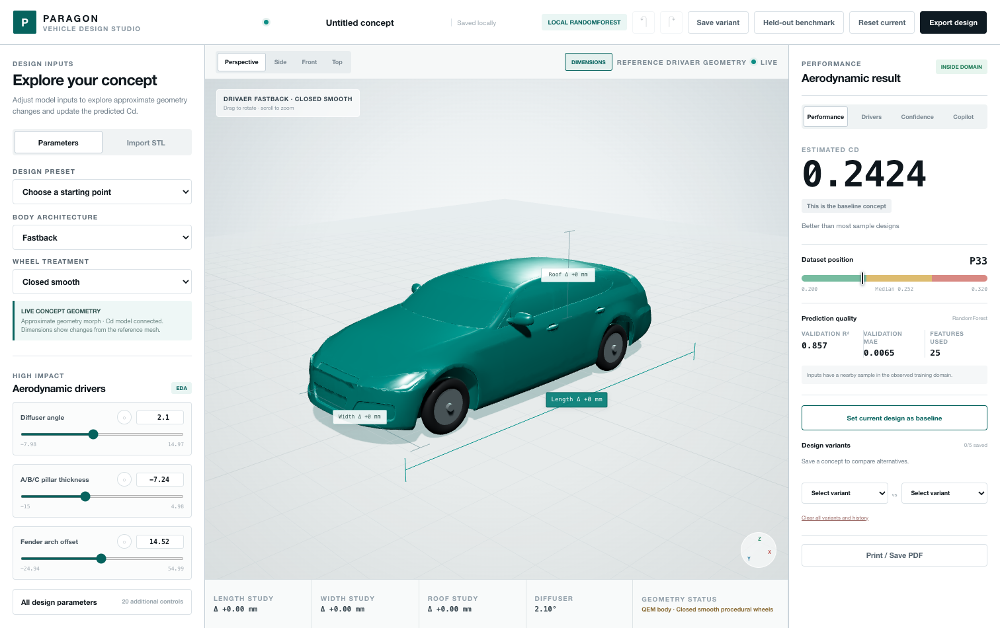

# Paragon — Car Drag Analyzer

**Predict automotive drag coefficient (Cd) in seconds, not weeks.**

**▶ [Live demo](https://qulcomm-institute-team-a.onrender.com/)** — free instance, so the first request after idle takes ~1 minute to wake.

CFD is the standard way to measure aerodynamic drag, and it is slow and expensive — days to weeks of supercomputer time per high-fidelity design. Building the DrivAerNet++ dataset alone took 2,880 CPU cores and 39 TB of storage. That cost makes the thing designers actually need impossible: rapidly comparing many candidate shapes in early-stage design.

Paragon replaces that inner loop with a learned surrogate. Upload a 3D model or move a slider, get a Cd estimate immediately. It is **not** a CFD replacement — it is the fast pre-filter that runs *before* CFD.



---

## Team Introduction

**Chosun University — Qualcomm Institute Team A**

| Member | GitHub | Focus |
|---|---|---|
| Dongwon Lim | [@parag0hz](https://github.com/parag0hz) | ML pipeline, PointNet training & serving, demo, deployment |
| Soomin | [@barcybarcy](https://github.com/barcybarcy) | Web application (frontend + FastAPI backend), Vertex AutoML integration |
| Sangwoo | [@tmrhdwja2-alt](https://github.com/tmrhdwja2-alt) | Application development |
| Chaewon Jeong | [@chaewon8699-source](https://github.com/chaewon8699-source) | Application development |
| Minju | [@chaeminju](https://github.com/chaeminju) | Application development |

> _Roles above are drawn from repository history — team members can refine their own descriptions._

## Service Introduction

**Paragon (CFA — Car Fluid Analyzer)** predicts a vehicle's aerodynamic drag coefficient (Cd) the moment you change its shape. CFD — the standard way to measure drag — takes days to weeks per design and needs supercomputer-scale compute, so early-stage designers rarely run it. Paragon replaces that inner loop with a trained surrogate: adjust design parameters or upload a 3D point cloud, and get a Cd estimate in milliseconds, with the uncertainty stated rather than hidden.

**Who it's for** — automotive designers who need fast aerodynamic feedback without CFD expertise, and product teams comparing candidate designs early.

**What you can do**

- **Move design sliders** and watch the 3D vehicle and predicted Cd update live.
- **Upload a point cloud** (`.paddle_tensor` / `.npy`) and get a prediction from the trained PointNet model — the same model behind the held-out benchmark.
- **Compare candidates** and see where each ranks against the DrivAerNet++ design population.
- **Optimize toward a target Cd** and receive concrete design-change directions.
- **Ask the Copilot** — it explains each result using the model's own numbers, never invented figures.

**▶ Try it live:** <https://qulcomm-institute-team-a.onrender.com/>

---

## Results

We train on [DrivAerNet++](https://github.com/Mohamedelrefaie/DrivAerNet) (Elrefaie et al., NeurIPS 2024) — 7,713 sedan variants, 100k points each, with CFD-computed Cd labels.

### Shape beats parameters — same cars, same folds

The honest comparison. Both tracks see identical vehicles and identical splits (3,704 designs in the point-cloud ∩ parameter-CSV intersection, K=5 rotating folds, body-type stratified).

| Model | Input | R² | MAE (drag counts) | Pairwise ranking |
|---|---|---:|---:|---:|
| **PointNet** | Point cloud (2048 pts) | **0.878 ± 0.007** | **6.25** | **89.1 %** |
| DGCNN | Point cloud (2048 pts) | 0.847 ± 0.006 | 7.10 | 87.6 % |
| RegDGCNN | Point cloud (2048 pts) | 0.805 ± 0.007 | 8.11 | 87.3 % |
| AutoGluon | 23 design parameters | 0.573 ± 0.027 | 11.66 | 78.3 % |
| LightGBM | 23 design parameters | 0.557 ± 0.033 | 11.75 | 78.0 % |
| RandomForest | 23 design parameters | 0.486 ± 0.025 | 12.78 | 75.8 % |

Every shape model beats every parameter model: even the weakest, RegDGCNN (0.805), clears the strongest parameter model, AutoGluon (0.573), by 0.23 — the choice of input modality dominates the choice of model. The gap is widest exactly where it matters. On **Estate** bodies, parameter models collapse — AutoGluon reaches R² +0.038 and RandomForest goes *negative* (−0.257), i.e. worse than predicting the mean. PointNet holds at **+0.824**. Global averages hide this, which is why every number here is decomposed by body type.

### Against the published benchmark

On the official DrivAerNet++ test split (1,158 designs):

| Model | Paper (Table 4) | Ours |
|---|---:|---:|
| PointNet | 0.643 | **0.968** |
| RegDGCNN | 0.641 | 0.894 |

We traced the gap to the reference pipeline rather than the architecture: per-cloud min–max normalization erases absolute scale, and the author dataset class applies 1 cm jitter to val/test as well. Running the authors' own code and conditions on our data still yields 0.867.

> **1 drag count = 0.001 Cd.** Literature treats MAE < 5 counts as acceptable for surrogate screening.

**Why PointNet reads 0.968 in one table and 0.878 in the other.** These measure different things, and neither is cherry-picked. The benchmark number uses the official split over all 7,713 designs. The comparison number uses only the 3,704 designs that have *both* a point cloud and a parameter row — the intersection needed to put both tracks on identical footing. That halves the training data and narrows Cd variance from 0.037 to 0.023, which mechanically depresses R². AutoGluon actually scores slightly *higher* under the stricter protocol (0.549 → 0.573). The **+0.305 gap between shape and parameters is the real figure**, because it is the only one measured under matched conditions.

### What we will not claim

- Official-split R² **overstates generalization.** We measured this ourselves: voxel 1-NN retrieval alone scores 0.865, family holdout drops to 0.75–0.80, and holding out an entire body type falls to 0.457.
- **Small differences are not trustworthy.** For predicted ΔCd below 5 counts, our sign accuracy is 57 % — a coin flip. It reaches 77 % at 5–15 counts and 95 % above 15. The UI is built around this limit rather than hiding it.
- Absolute Cd certification is out of scope. Paragon ranks and screens; a wind tunnel or high-fidelity CFD decides.

---

## How it works

```
Track 1 — ML   23 design parameters  ──►  Gradient-boosted / RF surrogate  ──►  Cd
Track 2 — DL   STL / point cloud  ──►  FPS-2048 sampling  ──►  PointNet (0.81 M)  ──►  Cd
```

Two design decisions carry most of the accuracy:

1. **Keep metre scale.** Cd is dimensionless, but in this dataset absolute size is the strongest single signal (vehicle height correlates r = +0.83). Unit-normalizing the point cloud — the PointNet convention — throws that away.
2. **Report by body type.** Fastback is 68 % of the data, so a single global score hides Estate and Notchback failures.

The smallest model wins: PointNet (0.81 M parameters) beats DGCNN (1.80 M) and RegDGCNN (3.16 M). Drag is dominated by the global silhouette, not local surface detail — which is also why CPU serving is viable.

---

## Repository layout

| Path | Contents |
|---|---|
| `src/web/cfa_service/` | FastAPI backend — prediction, sensitivity drivers, constrained optimisation, STL parsing, provider routing |
| `src/web/frontend/` | React + TypeScript + Zustand studio, Three.js viewer with live geometry morphing |
| `src/web/models/` | Parametric baseline training, reference mesh preparation |
| `src/ParametricModels/` | DrivAerNet++ parametric CSV (4,165 designs) |
| `ml/` | Research pipeline — training, evaluation protocol, experiment reports ([details](ml/README.md)) |
| `Dockerfile`, `render.yaml` | Single-service deployment |

---

## Quick start

Requires **Python 3.10–3.12** and **Node 20.19+ or 22.12+** (Node 26 breaks the test suite — it ships a native `localStorage` that shadows jsdom's).

```bash
cd src

# Backend
python -m venv .venv && source .venv/bin/activate   # or: conda create -n paragon python=3.12
pip install -r web/requirements-web.txt
python web/models/train_parametric_baseline.py       # trains the surrogate (~5 s)
python -m uvicorn web.cfa_service.app:app --port 8001 --reload

# Frontend (second terminal)
npm install
npm run dev:web                                      # http://127.0.0.1:5173
```

The trained artifact is not committed (~35 MB); the training command above regenerates it from the CSV.

### Tests

```bash
npm run typecheck && npm run test:web                     # 20 frontend tests
python -m unittest discover -s web/tests -p 'test_*.py'   # 26 backend tests
```

---

## Deployment

A single service serves both the API and the built SPA — the frontend uses relative paths, so no CORS or gateway configuration is needed.

```bash
docker build -t paragon . && docker run -p 8000:8000 paragon
```

On Render, `render.yaml` provisions it as a Blueprint. The frontend bundle is built and the surrogate is trained during the image build, so no model artifact ever enters version control.

---

## Honest limitations

- **Sedan variants only.** The training set is DrivAer sedan derivatives. SUVs, trucks, and commercial vehicles are out of distribution; the app flags this rather than answering confidently.
- **Simulation, not reality.** Performance is demonstrated against CFD labels. No real-vehicle scan has been validated against a manufacturer-published Cd.
- **Degraded-input performance is unmeasured.** Phone-scan conditions — partial coverage, noise, sparsity — are the intended real-world input, and PointNet's accuracy under them is the largest open gap in this project.
- **Approximate geometry morphing.** The 3D viewer deforms a reference mesh to visualise parameter changes. It is a design aid, not CAD output.

---

## Documents

- **[Product Requirements Document (PDF)](docs/PRD.pdf)** — problem, users, feature requirements, scope, and risks.
- **[ML research pipeline](ml/README.md)** — training, evaluation protocol, and full experiment reports.

Dataset: DrivAerNet++, Elrefaie et al., *NeurIPS 2024 Datasets & Benchmarks*.
