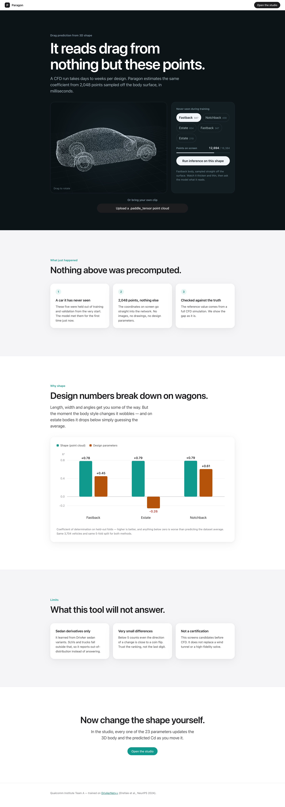

# Paragon — Vehicle Drag Coefficient Analysis
Paragon — the standard a design is measured against.

**Predict automotive drag coefficient (Cd) in seconds, not weeks.**

## Executive summary
Paragon developed an AI service platform that predicts a vehicle’s aerodynamic drag coefficient (Cd) based solely on its exterior design. Traditionally, estimating the drag coefficient requires designing the vehicle and performing computational fluid dynamics (CFD) simulations, a process that is both time-consuming and expensive. By leveraging AI technologies, the platform can generate accurate drag coefficient predictions in a fraction of the time. This significantly reduces development costs while accelerating the vehicle design process. The solution improves productivity not only for automotive designers but also for engineers involved in vehicle development.

Concretely: upload a 3D point cloud of a vehicle, or simply move a design slider, and Paragon predicts Cd in milliseconds with a PointNet surrogate trained on CFD-labelled data. Beyond the number, it reports where the design ranks within the DrivAerNet++ population, which design parameters drive the result, and whether the model is confident at that size of change. A design copilot built on a large language model (OpenAI GPT) then explains the result in plain language, using only figures the model itself produced. Paragon is **not** a CFD replacement — it is the fast pre-filter that runs *before* CFD, making early-stage aerodynamic exploration accessible to teams that do not own a compute cluster.

**▶ [Live demo](https://qulcomm-institute-team-a.onrender.com/)** — free instance, so the first request after idle takes about a minute to wake.



## Team Introduction
**Team A — QI 2026 Summer**

| Name | GitHub | Role |
|---|---|---|
| Sumin Cho | [@barcybarcy](https://github.com/barcybarcy) | **Team leader** · Web application (frontend + FastAPI backend) · Vertex AutoML integration |
| Dongwon Lim | [@parag0hz](https://github.com/parag0hz) | ML pipeline · PointNet training & serving · demo · deployment |
| Sangwoo Sim | [@tmrhdwja2-alt](https://github.com/tmrhdwja2-alt) | Application development |
| Chaewon Jeong | [@chaewon8699-source](https://github.com/chaewon8699-source) | Application development |
| Minju Chae | [@chaeminju](https://github.com/chaeminju) | Application development |

## Service Introduction
Paragon (internally *CFA — Car Fluid Analyzer*) predicts a vehicle's aerodynamic drag coefficient the moment its shape changes, explains what drove that number, ranks the design against a population of CFD-simulated cars, and states how much of the difference is actually trustworthy.

Upload a point cloud of a car — or move the 23 design sliders — and Paragon samples 2,048 points off the body surface with farthest-point sampling, runs a trained PointNet regressor on CPU, places the result against 7,713 CFD-labelled designs, and has an LLM walk you through the outcome: what the number means, which parameters moved it, and whether the change is large enough to act on. Delivered as a single web service that serves the API and the interface from one origin, so it runs in any browser with nothing to install.

**Who it is for** — automotive designers who need fast aerodynamic feedback without CFD expertise, and product teams comparing candidate designs in early-stage exploration.

## The Problem
CFD is the standard way to measure aerodynamic drag, and it is slow and expensive — days to weeks of supercomputer time per high-fidelity design. Building the DrivAerNet++ dataset alone consumed roughly 3 × 10⁶ CPU-hours across 2,880 cores and 39 TB of storage. That cost rules out the thing designers actually need: rapidly comparing many candidate shapes while the geometry is still changing daily.

The fast alternatives predict from design parameters rather than geometry, so they never see the shape itself — and they report one global score that hides exactly where they fail. Nothing in that loop tells a designer when a predicted difference is too small to be real.

## What Paragon Does
- **Predict** — A PointNet regressor reads 2,048 points sampled off the body surface and returns Cd in milliseconds on CPU. No GPU, no meshing, no solver setup.
- **Read the real shape** — Point clouds keep their metre scale, so absolute vehicle size (the strongest single signal in this dataset) survives into the model instead of being normalised away.
- **Explain** — An LLM (OpenAI GPT) turns the confirmed prediction into a readable explanation of what drove the number, without re-predicting or inventing figures. Without an API key, a grounded local explainer produces the same answer from the same evidence.
- **Explore and optimise** — Move design sliders and watch the 3D vehicle and predicted Cd update live, see which parameters carry the sensitivity, lock the ones you cannot change, and optimise toward a target Cd.
- **State its own limits** — Every result is reported against the model's measured confidence: below 5 drag counts the model's sign accuracy is 57 %, and the interface is built around that limit rather than hiding it.

## Key Differentiators
Paragon is compared here against classes of method, not against commercial products, and every mark in the Paragon column is backed by a measurement in [Results](#results):

| Capability | High-fidelity CFD | Parameter-only surrogate | Shape model alone | Paragon |
|---|---|---|---|---|
| Answer in seconds | ✗ | ✓ | ✓ | ✓ |
| Reads the 3D shape itself | ✓ | ✗ | ✓ | ✓ |
| Runs on CPU without a cluster | ✗ | ✓ | ✓ | ✓ |
| Accuracy decomposed by body type | — | ✗ | △ | ✓ |
| Says when a difference is too small to trust | — | ✗ | ✗ | ✓ |
| Interactive design loop (sliders → drivers → target → explanation) | ✗ | △ | ✗ | ✓ |

## How It Works
```
Shape path       .paddle_tensor cloud → safe parse → FPS-2048 (metre scale kept)
                   → PointNet (0.81 M params, ONNX on CPU) → Cd + preview points

Mesh path        .stl upload → binary/ASCII parse → geometric proportions
                   → lower-confidence estimate (labelled as such; this path is not PointNet)

Parameter path   23 design sliders → RandomForest surrogate (or Vertex AutoML, if configured)
                   → Cd → sensitivity drivers → constrained optimisation

All paths        Cd → body-type population ranking → grounded LLM explanation
```
The LLM never predicts — it only explains and curates numbers already produced by the surrogate and by the DrivAerNet++ statistics, grounded to prevent hallucination. If the OpenAI key is absent or the call fails, the service falls back to a local explainer built from the same evidence rather than fabricating a result.

## Project Structure
```
.
├── frontend/                      # React + TypeScript + Vite single-page app
│   ├── src/
│   │   ├── main.tsx               # Path split without a router: "/" → demo, "/studio" → workspace
│   │   ├── DemoPage.tsx           # Landing demo: 5 held-out cars, point-cloud viewer, upload
│   │   ├── App.tsx                # Studio: sliders, baseline, locks, variants, results, copilot
│   │   ├── api.ts                 # Fetch layer for the backend routes
│   │   ├── store.ts               # Zustand store, persisted to localStorage (design/baseline/locks/variants)
│   │   ├── components/
│   │   │   ├── VehicleViewer.tsx      # Three.js reference mesh with approximate geometry morphing
│   │   │   ├── PointCloudViewer.tsx   # Held-out and uploaded point clouds
│   │   │   ├── HoldoutBenchmark.tsx   # Live inference on held-out cars: predicted vs CFD truth
│   │   │   ├── DesignControls.tsx     # 23 design sliders + .paddle_tensor / .stl upload
│   │   │   ├── ResultsPanel.tsx       # Cd readout, sensitivity drivers, optimisation result
│   │   │   ├── BodyTypeChart.tsx      # Where the design ranks in the DrivAerNet++ population
│   │   │   ├── CopilotPanel.tsx       # Grounded explanation panel
│   │   │   └── *.test.tsx             # Vitest component and integration tests
│   │   └── demo.css, styles.css
│   ├── vite.config.ts             # Dev server, proxies /api and /static to FastAPI on :8001
│   └── package.json
├── backend/                       # FastAPI server: API + built SPA from a single origin
│   ├── cfa_service/
│   │   ├── app.py                 # 13 API routes + SPA catch-all
│   │   ├── predictor.py           # Parametric prediction, sensitivity drivers, constrained optimisation
│   │   ├── pointnet.py            # PointNet serving through ONNX Runtime (CPU)
│   │   ├── paddle_cloud.py        # .paddle_tensor parsing + farthest-point sampling to 2,048
│   │   ├── stl.py                 # Binary/ASCII STL parsing for the geometric fallback path
│   │   ├── copilot.py             # OpenAI Responses API (default gpt-5-mini) + grounded local explainer
│   │   ├── providers.py           # Local RandomForest ↔ Vertex AutoML routing with fallback
│   │   ├── config.py, schemas.py  # .env loading, request/response validation
│   │   └── static/models/         # QEM-decimated reference GLB for the 3D viewer
│   ├── models/
│   │   ├── train_parametric_baseline.py  # RandomForest surrogate — the serving default (~5 s)
│   │   └── prepare_reference_mesh.py     # Reference mesh preparation
│   ├── ParametricModels/          # DrivAerNet++ parametric CSV (4,165 designs)
│   ├── tests/                     # API, core predictor, PointNet serving, provider suites
│   ├── requirements-web.txt       # Serving runtime (FastAPI, scikit-learn, onnxruntime)
│   └── .env.example               # Provider and copilot configuration template
├── ml/                            # Research pipeline — training and evaluation protocol
│   ├── train_r2.py, models_pc.py, precompute_fps.py, eval_metrics.py
│   ├── scripts/                   # protocol.py, run_protocol_comparison.py, holdout_eval.py, export_pointnet_onnx.py
│   ├── models/                    # pointnet_serving.onnx — the weights the web service serves
│   ├── data/demo_holdout.json     # The 5 demo cars, excluded from train/val/test
│   └── *.md                       # RESULTS, PROTOCOL_COMPARISON, METRICS, EXPERIMENT_REPORT
├── docs/PRD.pdf                   # Product Requirements Document
├── Dockerfile                     # Single image: SPA build + runtime + surrogate training
├── render.yaml                    # Render Blueprint (one service)
└── LICENSE                        # CC BY-NC 4.0
```

## User Flow
```
Landing ("/") → pick one of 5 held-out cars (or upload your own .paddle_tensor)
  → PointNet inference → predicted Cd against the CFD ground truth
    → Studio ("/studio") → move the 23 design sliders → live Cd + 3D morphing
      → sensitivity drivers → lock fixed parameters → optimise toward a target Cd
        → compare variants → ask the copilot why
```
There are no accounts and no server-side storage: every route is public, and the studio keeps the current design, baseline, parameter locks, and saved variants in browser state (Zustand, persisted to `localStorage`). The five cars on the landing page come from `ml/data/demo_holdout.json` and are excluded from training, validation and test, so the demo always runs the model on shapes it has never seen.

## Prediction Paths and Confidence Rules
**Upload formats.** `.paddle_tensor` point clouds run the trained PointNet surrogate directly. `.stl` meshes run a lower-confidence geometric-proportion fallback, labelled as such in the interface — an STL upload is not a PointNet prediction. Uploads are capped at 32 MB. Other formats, including `.npy`, are rejected rather than silently mishandled.

**Provider routing.** The parameter path serves a local RandomForest surrogate by default (`PARAGON_PROVIDER=local`). With Vertex AutoML configured it routes there instead, and falls back to the local model if the endpoint is unavailable.

**Confidence rules.** 1 drag count = 0.001 Cd; the literature treats MAE below 5 counts as acceptable for surrogate screening.

| Predicted ΔCd | Sign accuracy | How the interface treats it |
|---|---:|---|
| below 5 counts | 57 % | a coin flip — presented as indistinguishable, not as an improvement |
| 5–15 counts | 77 % | directional, worth exploring |
| above 15 counts | 95 % | a difference you can act on |

**Out of distribution.** The training set is DrivAer sedan derivatives. SUVs, trucks, and commercial vehicles are out of distribution, and the app flags this rather than answering confidently.

## Results
We train on [DrivAerNet++](https://github.com/Mohamedelrefaie/DrivAerNet) (Elrefaie et al., NeurIPS 2024) — 7,713 sedan variants with point clouds of 100k points each and CFD-computed Cd labels.

### Shape beats parameters — same cars, same folds
The honest comparison. Both tracks see identical vehicles and identical splits (3,704 designs in the point-cloud ∩ parameter-CSV intersection, K=5 rotating folds, body-type stratified).

| Model | Input | R² | MAE (drag counts) | Pairwise ranking |
|---|---|---:|---:|---:|
| **PointNet** | Point cloud (2048 pts) | **0.878 ± 0.007** | **6.25** | **89.1 %** |
| DGCNN | Point cloud (2048 pts) | 0.847 ± 0.006 | 7.10 | 87.6 % |
| RegDGCNN | Point cloud (2048 pts) | 0.805 ± 0.007 | 8.11 | 87.3 % |
| AutoGluon | 23 design parameters | 0.573 ± 0.027 | 11.66 | 78.3 % |
| LightGBM | 23 design parameters | 0.557 ± 0.033 | 11.75 | 78.0 % |
| RandomForest | 23 design parameters | 0.486 ± 0.025 | 12.78 | 75.8 % |

Every shape model beats every parameter model: even the weakest, RegDGCNN (0.805), clears the strongest parameter model, AutoGluon (0.573), by 0.23 — the choice of input modality dominates the choice of model. The gap is widest exactly where it matters. On **Estate** bodies, parameter models collapse — AutoGluon reaches R² +0.038 and RandomForest goes *negative* (−0.257), i.e. worse than predicting the mean. PointNet holds at **+0.823**. Global averages hide this, which is why every number here is decomposed by body type.

### Against the published benchmark
On the official DrivAerNet++ test split (1,158 designs):

| Model | Paper (Table 4) | Ours |
|---|---:|---:|
| PointNet | 0.643 | **0.968** |
| RegDGCNN | 0.641 | 0.894 |

We traced the gap to the reference pipeline rather than the architecture: per-cloud min–max normalization erases absolute scale, and the author dataset class applies 1 cm jitter to val/test as well. Running the authors' own code and conditions on our data still yields 0.867.

**Why PointNet reads 0.968 in one table and 0.878 in the other.** These measure different things, and neither is cherry-picked. The benchmark number uses the official split over all 7,713 designs. The comparison number uses only the 3,704 designs that have *both* a point cloud and a parameter row — the intersection needed to put both tracks on identical footing. That halves the training data and narrows Cd variance from 0.037 to 0.023, which mechanically depresses R². AutoGluon actually scores slightly *higher* under the stricter protocol (0.549 → 0.573). The **+0.305 gap between shape and parameters is the real figure**, because it is the only one measured under matched conditions.

### Two design decisions carry most of the accuracy
1. **Keep metre scale.** Cd is dimensionless, but in this dataset absolute size is the strongest single signal (vehicle height correlates r = +0.83). Unit-normalizing the point cloud — the PointNet convention — throws that away.
2. **Report by body type.** Fastback is 68 % of the data, so a single global score hides Estate and Notchback failures.

The smallest model wins: PointNet (0.81 M parameters) beats DGCNN (1.80 M) and RegDGCNN (3.16 M). Drag is dominated by the global silhouette, not local surface detail — which is also why CPU serving is viable.

## What Paragon Will Not Claim
- Official-split R² **overstates generalization.** We measured this ourselves: voxel 1-NN retrieval alone scores 0.865, family holdout drops to 0.75–0.80, and holding out an entire body type falls to 0.457.
- **Small differences are not trustworthy.** For predicted ΔCd below 5 counts, sign accuracy is 57 % — a coin flip. The interface is built around this limit rather than hiding it.
- **Absolute Cd certification is out of scope.** Paragon ranks and screens; a wind tunnel or high-fidelity CFD decides.
- **Simulation, not reality.** Performance is demonstrated against CFD labels. No real-vehicle scan has been validated against a manufacturer-published Cd.
- **Degraded-input performance is unmeasured.** Phone-scan conditions — partial coverage, noise, sparsity — are the intended real-world input, and accuracy under them is the largest open gap in this project.
- **Approximate geometry morphing.** The 3D viewer deforms a reference mesh to visualise parameter changes. It is a design aid, not CAD output.

## First Setup (Cloning the Repository)
Requires **Python 3.10–3.12** and **Node 20.19+ or 22.12+**. Node 26 breaks the frontend test suite — it ships a native `localStorage` that shadows jsdom's.

```bash
git clone https://github.com/parag0hz/Qulcomm_Institute_team_a.git
cd Qulcomm_Institute_team_a

python -m venv .venv && source .venv/bin/activate    # or: conda create -n paragon python=3.12
pip install -r backend/requirements-web.txt
```

The served PointNet weights (`ml/models/pointnet_serving.onnx`) are committed, so shape predictions work immediately. Only the parametric surrogate is trained locally — its ~35 MB artifact is deliberately kept out of version control and regenerated from the CSV in about five seconds.

## Running the Application
Configuration is optional. To enable Vertex AutoML or the LLM copilot, copy `backend/.env.example` to `backend/.env`:

```bash
PARAGON_PROVIDER=local          # local RandomForest (default) or vertex
VERTEX_PROJECT_ID=              # required only for PARAGON_PROVIDER=vertex
VERTEX_LOCATION=us-central1
VERTEX_ENDPOINT_ID=

OPENAI_API_KEY=                 # optional — without it the grounded local explainer is used
OPENAI_MODEL=gpt-5-mini
```

Then run the two processes:

```bash
# Terminal 1 — backend, from the repository root
python backend/models/train_parametric_baseline.py     # trains the RandomForest surrogate (~5 s)
python -m uvicorn backend.cfa_service.app:app --port 8001 --reload

# Terminal 2 — frontend
cd frontend
npm install
npm run dev:web                                        # http://127.0.0.1:5173
```

Vite proxies `/api` and `/static/models` to FastAPI on port 8001, so browser requests use the same paths as the production build. API documentation is served at `http://127.0.0.1:8001/docs`.

## Deployment
One service serves both the API and the built SPA. The frontend uses relative paths, so there is no CORS or gateway configuration.

```bash
docker build -t paragon . && docker run -p 8000:8000 paragon
```

On Render, `render.yaml` provisions the service as a Blueprint from the same Dockerfile.

| Build step | What happens | Why |
|---|---|---|
| Node stage | `npm ci` and `npm run build:web` | produces `frontend/dist`, bundled into the image |
| Python stage | installs `backend/requirements-web.txt` | FastAPI, scikit-learn, ONNX Runtime — CPU only |
| Weights | copies `ml/models` into the service package | the PointNet ONNX checkpoint ships with the image |
| Surrogate | runs `train_parametric_baseline.py` at build time | no model artifact ever enters version control |
| Runtime | `uvicorn ... --port ${PORT}` | the platform injects `$PORT`; the container defaults to 8000 |

The public demo runs on a free instance, which sleeps when idle — the first request afterwards takes roughly 20–60 seconds to wake.

## Tests
```bash
# Frontend — 27 tests across 6 files (components, store, API layer, app integration)
cd frontend && npm run typecheck && npm run test:web

# Backend — 36 tests across 4 suites, from the repository root
python -m unittest discover -s backend/tests -p 'test_*.py'
```
The backend suites cover the API routes (`test_api.py`), the predictor and optimiser core (`test_cfa_core.py`), PointNet serving and point-cloud parsing (`test_pointnet.py`), and provider routing with its Vertex fallback (`test_providers.py`). The frontend suite runs under Vitest with jsdom and needs no running backend — the API layer is stubbed.

## Frontend (React + Vite)
The `frontend/` directory is a standalone Vite project; all npm commands run from inside it.

```bash
cd frontend
npm install
npm run dev:web        # dev server on http://127.0.0.1:5173
npm run build:web      # typecheck + production bundle into frontend/dist
npm run test:web       # Vitest
```

- Styles are plain CSS: `src/styles.css` for the studio, `src/demo.css` for the landing demo. The two screens deliberately do not share a stylesheet.
- 3D rendering uses Three.js directly, wrapped in React components — a decimated reference GLB for parameter morphing, and a point renderer for uploaded or held-out clouds.
- `frontend/dist/` is a build artifact and is not committed; the Docker image builds it.

## Notes
- The five demo cars are held out of every split, so landing-page numbers are genuine unseen-shape predictions rather than recall.
- The research pipeline in `ml/` expects the DrivAerNet++ data locally (tens of GB); it is not part of this repository. See [ml/README.md](ml/README.md).
- For product requirements and technical scope, see [docs/PRD.pdf](docs/PRD.pdf).

## License
Released under the **Creative Commons Attribution-NonCommercial 4.0 International (CC BY-NC 4.0)** license — see [LICENSE](LICENSE). The DrivAerNet++ dataset carries its own terms and must be cited as below when this work is reused.

## Acknowledgments
This AI Service Platform was developed as part of the [**17th QI AI Entrepreneurship Program – Summer 2026 (full content)**](https://www.kaggle.com/code/QualcommInstituteAI/17th-qi-ai-entrepreneurship-program-summer-2026) & [(summary record)](https://github.com/Qualcomm-Institute-AI/QI-AI-Programs/tree/main/2026/Summer/17th%20QI%20AI%20Entrepreneurship%20Program), hosted by the Qualcomm Institute (QI), University of California, San Diego (UC San Diego).

We would like to express our sincere gratitude to [Dr. Seokheon Cho](https://www.linkedin.com/in/justin-cho-phd/) of the Qualcomm Institute for his extensive guidance, supervision, and support throughout the development of this platform.

We also acknowledge the following source of research support:

This research was supported by the MSIT (Ministry of Science and ICT), Korea, under the National Program for Excellence in SW (2021-0-01393), supervised by the IITP (Institute of Information & Communications Technology Planning & Evaluation).

This research was supported by the MSIT (Ministry of Science and ICT), Korea, under the National Program for Excellence in SW (2024-0-00062), supervised by the IITP (Institute of Information & Communications Technology Planning & Evaluation) in 2026.

## Dataset, AI Model & References

### Datasets and data sources

- **[DrivAerNet++](https://github.com/Mohamedelrefaie/DrivAerNet)** — Vehicle point clouds, design parameters, and CFD-computed drag coefficients used to train and evaluate our prediction models. [Elrefaie et al. (2024a)]
- **[PaddleScience / Baidu distribution](https://paddlescience-docs.readthedocs.io/zh-cn/latest/en/examples/drivaernetplusplus/#2-problem-definition)** — The DrivAerNet++ distribution providing the .paddle_tensor point clouds, Cd labels, and benchmark splits used in our training pipeline. [Point-cloud download (8.63 GiB)](https://dataset.bj.bcebos.com/PaddleScience/DNNFluid-Car/DrivAer%2B%2B/DrivAer%2B%2B_Points.tar)

### AI Model
- **PointNet** — Ultimately selected for deployment on our platform due to its superior performance in vehicle drag coefficient analysis using point-cloud data.  [Qi et al. (2017)]
- **DGCNN** — Not selected for final deployment due to its lower performance in vehicle drag coefficient analysis using point-cloud data. [Wang et al. (2019)]
- **RegDGCNN** —  Not selected for final deployment due to its lower performance in vehicle drag coefficient analysis using point-cloud data. [Elrefaie et al. (2024b)]
- **Google Vertex AI AutoML** — Ultimately selected for deployment on our platform due to its superior performance in vehicle drag coefficient analysis using parametric data.
- **AutoGluon** — Not selected for final deployment due to its lower performance in vehicle drag coefficient analysis using parametric data. [Erickson et al. (2020)]
- **LightGBM / RandomForest** — Not selected for final deployment due to its lower performance in vehicle drag coefficient analysis using parametric data.

### References
Elrefaie, M., Morar, F., Dai, A., and Ahmed, F., "DrivAerNet++: A Large-Scale Multimodal Car Dataset with Computational Fluid Dynamics Simulations and Deep Learning Benchmarks," in *Advances in Neural Information Processing Systems 38 (NeurIPS 2024), Datasets and Benchmarks Track*, 2024. [[DOI](https://doi.org/10.48550/arXiv.2406.09624)]

Qi, C. R., Su, H., Mo, K., and Guibas, L. J., "PointNet: Deep Learning on Point Sets for 3D Classification and Segmentation," in *Proceedings of the IEEE Conference on Computer Vision and Pattern Recognition (CVPR)*, pp. 652–660, 2017. [[DOI](https://doi.org/10.48550/arXiv.1612.00593)]

Wang, Y., Sun, Y., Liu, Z., Sarma, S. E., Bronstein, M. M., and Solomon, J. M., "Dynamic Graph CNN for Learning on Point Clouds," *ACM Transactions on Graphics*, vol. 38, no. 5, pp. 1–12, 2019. [[DOI](https://doi.org/10.48550/arXiv.1801.07829)]

Elrefaie, M., Dai, A., and Ahmed, F., "DrivAerNet: A Parametric Car Dataset for Data-Driven Aerodynamic Design and Graph-Based Drag Prediction," in *Proceedings of the ASME IDETC-CIE*, 2024. [[DOI](https://doi.org/10.48550/arXiv.2403.08055)]

Erickson, N., Mueller, J., Shirkov, A., Zhang, H., Larroy, P., Li, M., and Smola, A., "AutoGluon-Tabular: Robust and Accurate AutoML for Structured Data," arXiv preprint, 2020. [[DOI](https://doi.org/10.48550/arXiv.2003.06505)]
